# HR Analytics SQL Project

## Project Overview

Employee attrition is one of the key workforce challenges that impacts organizational productivity, recruitment costs, and employee retention. This project analyzes HR employee attrition data using SQL to identify workforce trends and factors that may be associated with employee turnover.

The analysis follows a structured approach, beginning with overall KPIs, followed by department-level analysis, individual attrition factors, multi-factor analysis, and an overall employee summary. The objective is to identify meaningful patterns that can support HR teams in making data-driven retention decisions.

---

# Business Problem

The HR department wants to understand:

- What is the overall employee attrition rate?
- Which departments contribute the most to attrition?
- Does overtime influence employee attrition?
- Does annual training reduce attrition?
- Is employee performance related to attrition?
- Which role levels and salary bands experience higher attrition?
- How do tenure, promotion, job satisfaction, and work-life balance influence attrition?
- Are employees leaving because of a single factor or multiple contributing factors?

---

# Dataset Information

| Feature | Details |
|---------|---------|
| Dataset | Employee Attrition Dataset |
| Total Records | 15,000 Employees |
| Total Columns | 12 |
| Analysis Tool | SQL |
| SQL Environment | DB Fiddle |

### Dataset Columns

- Employee ID
- Department
- Role Level
- Tenure (Years)
- Salary Band
- Performance Rating
- Training Hours (Annual)
- Average Overtime Hours (Weekly)
- Job Satisfaction Score
- Work-Life Balance Score
- Years Since Last Promotion
- Attrition Flag

---

# Key Performance Indicators (KPIs)

### KPI Result

 
 

### Insights

- The organization consists of **15,000 employees**, with **3,797 employees leaving**, resulting in an overall attrition rate of **25.31%**.
- Approximately one out of every four employees has left the organization, indicating that employee retention may require further investigation.

---

## Department-wise Attrition Analysis

### Result

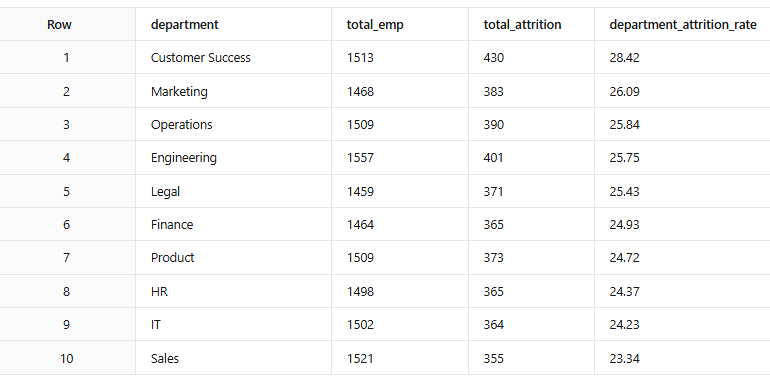

### Insights

- The **Customer Success** department recorded the highest attrition rate (**28.42%**), indicating a potential employee retention challenge within the department.
- The **Sales** department reported the lowest attrition rate (**23.34%**), suggesting comparatively better employee retention than other departments.

---

## Department Contribution to Overall Attrition

### Result

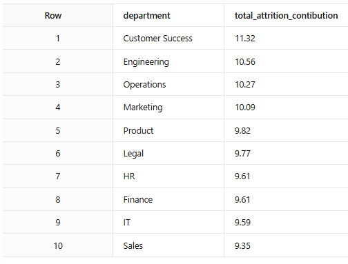

### Insights

- The **Customer Success** department contributed the highest share of overall employee attrition (**11.32%**), followed by **Engineering (10.56%)**.
- This indicates that Customer Success contributes the largest proportion of employee turnover and may require further department-level investigation.

---

## Attrition by Overtime

### Result

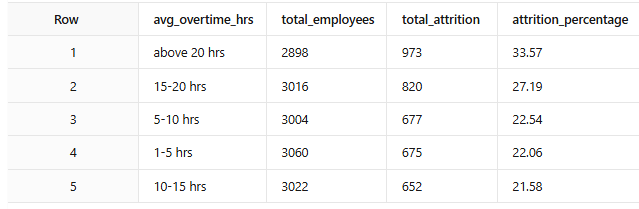

### Insights

- Employees working **more than 20 hours of average weekly overtime** recorded the highest attrition rate (**33.57%**).
- Attrition generally declines as overtime hours decrease.
- However, employees working **1–5 hours** of overtime experienced slightly higher attrition than those working **10–15 hours**, suggesting that overtime alone may not fully explain employee attrition and additional contributing factors should be investigated.

---

## Attrition by Annual Training Hours

### Result

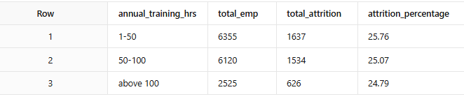

### Insights

- Employees receiving **1–50 annual training hours** recorded the highest attrition rate (**25.76%**).
- Employees with higher annual training hours experienced comparatively lower attrition.
- The analysis suggests that increased training alone does not determine employee attrition and should be evaluated alongside other workforce factors.

---

## Attrition by Performance Rating

### Result

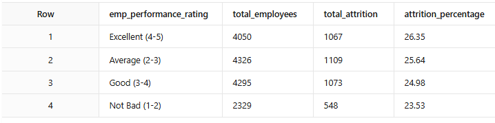

### Insights

- Employees with **excellent performance ratings (4–5)** recorded the highest attrition, while employees with lower performance ratings experienced comparatively lower attrition.
- This pattern suggests that high-performing employees may require additional attention regarding career growth, recognition, promotion opportunities, job satisfaction, and work-life balance.
- Further investigation is recommended before concluding that performance directly influences employee attrition.

---

## Attrition by Role Level

### Result

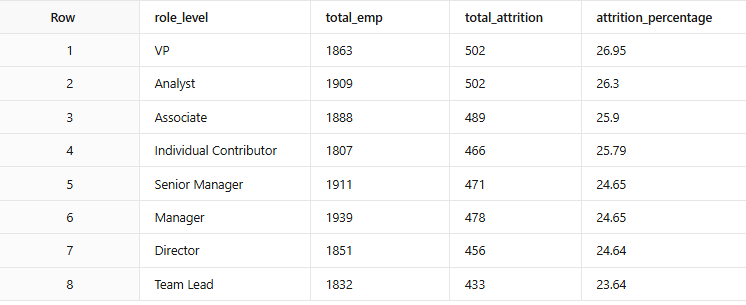

### Insights

- **VP** and **Analyst** roles recorded the highest attrition rates (**26.9%** and **26.3%**, respectively).
- Although the number of employees differs across role levels, both roles demonstrate comparatively higher attrition rates.
- This suggests that retention strategies may require role-specific analysis rather than focusing solely on workforce size.

---

## Attrition by Salary Band

### Result

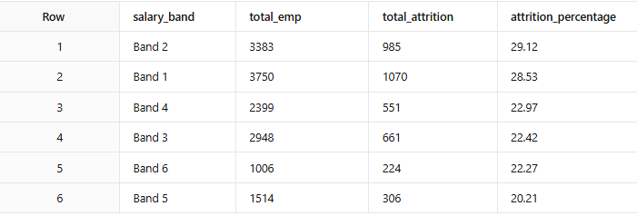

### Insights

- **Salary Bands 1 and 2** recorded the highest attrition rates (**29.1%** and **28.5%**, respectively).
- A noticeable difference exists compared with higher salary bands, indicating that employees in lower salary bands may face greater retention challenges.
- Since salary may not be the only influencing factor, additional employee attributes should also be considered during further investigation.

---

# Analysis Summary (Part 1)

The initial analysis indicates that employee attrition is not concentrated around a single workforce characteristic. Department, overtime, training hours, performance, role level, and salary band each demonstrate noticeable patterns that may contribute to employee turnover. These findings provide the foundation for deeper multi-factor analysis performed in the next stage of the project.

---

# Multi-Factor Attrition Analysis

The following analysis combines multiple employee attributes to better understand workforce attrition. Instead of evaluating each factor independently, this section identifies patterns across tenure, role level, promotion history, job satisfaction, and work-life balance.

---

## Attrition by Tenure and Role Level

### Result

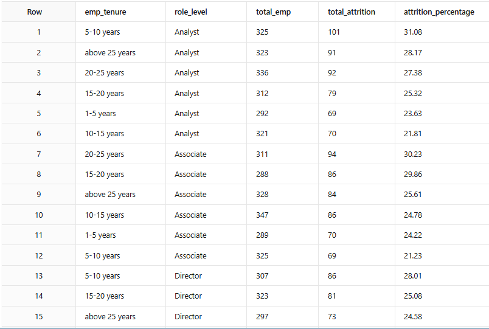

### Insights

- Employees with **1–5 years of tenure** recorded the highest attrition across multiple role levels, indicating that early-career employees experience comparatively higher employee turnover.
- Attrition remains relatively high among **VPs and Analysts** during the initial years of employment, suggesting that role responsibilities together with early tenure may influence employee retention.
- As employee tenure increases, attrition generally declines across most role levels.
- These findings indicate that employee retention strategies may require greater focus during the early years of employment while considering role-specific challenges.

---

## Attrition by Tenure and Job Satisfaction

### Result

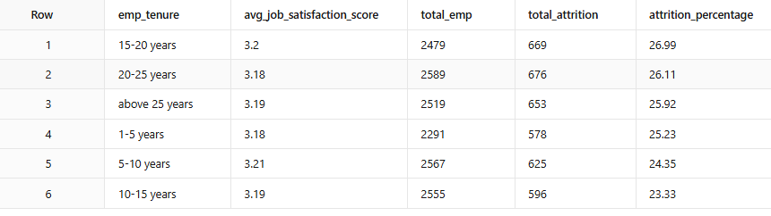

### Insights

- Employees with **1–5 years of tenure** recorded the highest attrition despite maintaining a moderate average job satisfaction score.
- Average job satisfaction gradually improves as employee tenure increases, while attrition continues to decline.
- The analysis suggests that job satisfaction alone may not fully explain employee attrition, and additional workforce factors should be considered before drawing conclusions.

---

## Attrition by Tenure and Promotion

### Result

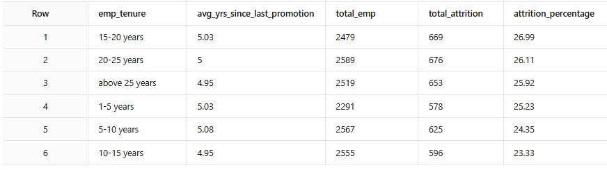

### Insights

- Employees experiencing higher attrition generally recorded a longer average duration since their last promotion.
- Attrition decreases as employee tenure increases, although promotion intervals also become longer over time.
- The findings suggest that promotion opportunities may contribute to employee retention; however, additional factors should be investigated before establishing a direct relationship.

---

## Attrition by Tenure and Work-Life Balance

### Result

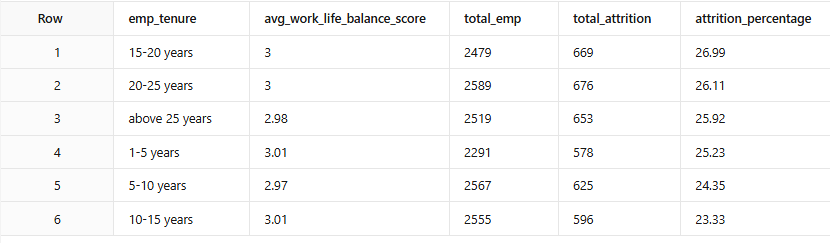

### Insights

- Employees within the **1–5 year tenure group** recorded the highest attrition while maintaining comparatively lower average work-life balance scores.
- Employees with longer tenure generally reported improved work-life balance together with lower attrition.
- These findings suggest that work-life balance may influence employee retention, although further investigation is recommended to evaluate its combined effect with other employee characteristics.

---

# Employee Risk Profile

### Result

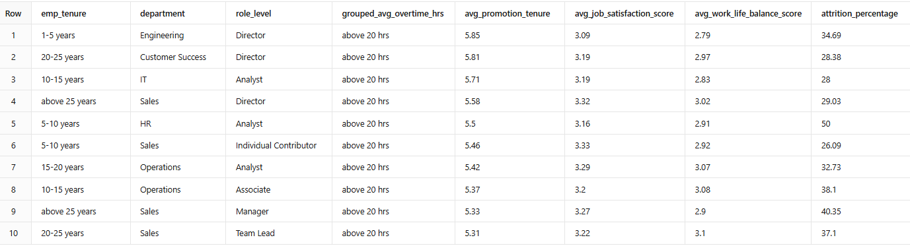

### Insights

- Employees with **shorter tenure**, **higher overtime**, **longer promotion intervals**, **lower work-life balance**, and **moderate job satisfaction** consistently appeared among the highest attrition groups.
- These recurring patterns indicate that employee attrition is associated with multiple workforce characteristics rather than a single contributing factor.
- The analysis suggests that improving employee retention may require a combination of initiatives addressing career progression, workload management, employee experience, and work-life balance instead of focusing on a single area.

---

# Overall Findings

The analysis identified several recurring workforce patterns associated with employee attrition:

- The organization recorded an overall attrition rate of **25.31%**, indicating that approximately one in four employees left the organization.
- Customer Success contributed the highest proportion of overall employee attrition.
- Employees working higher average overtime hours generally experienced higher attrition.
- Employees receiving lower annual training hours recorded comparatively higher attrition.
- High-performing employees also demonstrated comparatively higher attrition, suggesting that career development and employee engagement may require further investigation.
- Lower salary bands experienced greater employee turnover than higher salary bands.
- Employees within their first five years of employment consistently recorded the highest attrition across multiple analyses.
- Longer promotion intervals, lower work-life balance, and moderate job satisfaction frequently appeared alongside higher attrition.
- Overall, the findings suggest that employee attrition is influenced by multiple workforce characteristics rather than a single independent factor.

# Recommendations

Based on the analysis, the following recommendations may help improve employee retention while supporting data-driven HR decision-making.

### 1. Strengthen Retention Strategies for High-Attrition Departments

The Customer Success department contributed the highest proportion of overall employee attrition. Conduct department-level reviews, employee feedback sessions, and exit interview analysis to identify department-specific retention challenges.

---

### 2. Monitor Employee Workload and Overtime

Higher overtime hours were generally associated with increased attrition. Regularly monitoring employee workload, improving resource allocation, and encouraging healthy work-life balance may help reduce employee turnover.

---

### 3. Enhance Career Growth and Promotion Planning

Employees with longer promotion intervals appeared more frequently within higher attrition groups. Reviewing promotion cycles, career progression opportunities, and internal development programs may improve long-term employee retention.

---

### 4. Continue Investing in Employee Development

Employees receiving higher annual training hours generally experienced lower attrition. Although training alone may not determine employee retention, continuous learning opportunities may positively contribute to employee engagement and professional growth.

---

### 5. Review Retention Strategies for High-Performing Employees

Employees with excellent performance ratings also demonstrated comparatively higher attrition. Further investigation into recognition programs, career advancement opportunities, workload, and employee expectations may help improve retention among high-performing employees.

---

### 6. Evaluate Employee Experience During Early Tenure

Employees within their first five years of employment consistently recorded the highest attrition across multiple analyses. Strengthening onboarding, mentoring, career guidance, and employee engagement initiatives during the early stages of employment may improve retention.

---

### 7. Improve Employee Experience Through Combined HR Initiatives

The analysis suggests that employee attrition is associated with multiple workforce characteristics rather than a single factor. HR initiatives should therefore consider workload, career growth, employee satisfaction, work-life balance, and compensation together instead of addressing each factor independently.

---

# SQL Skills Demonstrated

This project demonstrates practical SQL skills commonly used in real-world business reporting and HR analytics.

### SQL Concepts Used

- Common Table Expressions (CTEs)
- Aggregate Functions
- CASE Statements
- GROUP BY
- ORDER BY
- Subqueries
- Percentage Calculations
- Data Categorization
- Business KPI Calculations
- Multi-factor Workforce Analysis
- Data Aggregation and Reporting

---

# Conclusion

This project demonstrates how SQL can be used to transform HR data into meaningful business insights. The analysis identified workforce patterns associated with employee attrition by evaluating department contribution, overtime, annual training, performance, role level, salary band, tenure, promotion history, job satisfaction, and work-life balance.

Rather than attributing employee turnover to a single cause, the findings suggest that attrition is influenced by multiple workforce characteristics. These insights can support HR teams in identifying potential retention risks and prioritizing areas for further investigation before implementing organizational changes.

---

⭐ *If you found this project interesting, feel free to explore the SQL queries and analysis included in this repository.*
